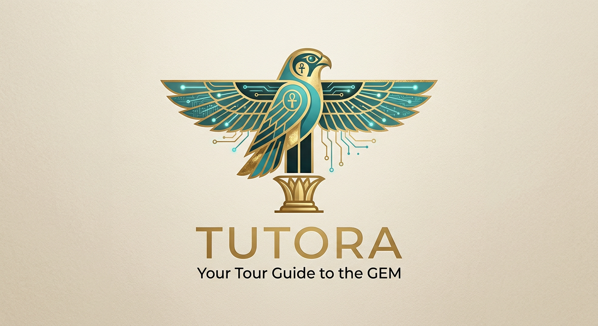

<p align="center">
  
</p>

<h1 align="center">🏛 Tutora Backend API</h1>

<p align="center">
<b>Your Tour Guide to the Grand Egyptian Museum</b>
</p>

<p align="center">
An AI-powered digital platform designed to enhance visitors' experience at the Grand Egyptian Museum through intelligent guidance, smart booking, artifact exploration, multimedia content, and multilingual support.
</p>

---

<p align="center">


</p>

---

# 📖 About Tutora

Tutora is a full-stack digital museum platform developed for the Grand Egyptian Museum (GEM).

The platform combines Artificial Intelligence, Smart Booking, Interactive Artifact Exploration, Multimedia Experiences, and Multilingual Support into one seamless visitor experience.

The backend is built with Node.js, Express.js, and MongoDB, following RESTful API architecture and modern security practices.

---

# ✨ Core Features

## 🔐 Authentication & Security

- User Registration
- User Login
- JWT Authentication
- Google Authentication
- Protected Routes
- Role-Based Access Control
- Password Encryption using bcrypt

---

## 👤 User Management

- User Profiles
- Profile Updates
- Profile Image Upload
- Cloudinary Integration

---

## 🎟 Booking System

- Museum Ticket Booking
- Dynamic Ticket Calculation
- Booking History
- Payment Status Tracking

---

## 💳 Payment Processing

- Secure Payment Workflow
- Booking Verification
- Paid / Pending Status Management

---

## ❤️ Favorites System

- Save Favorite Artifacts
- Save Favorite Events
- Remove Favorites
- Retrieve User Favorites

---

## 🏺 Artifact Management

- Retrieve Artifacts
- Artifact Details
- Multimedia Integration
- Video-Based Experience

---

## 📅 Event Management

- Retrieve Events
- Create Events
- Update Events
- Delete Events

---

## 🎥 Media Management

- Video Upload Support
- Cloudinary Storage
- Interactive Museum Content

---

## 🤖 AI Assistant

- AI Museum Guide
- Intelligent Recommendations
- Interactive Visitor Support

---

## 🌍 Language Support

- English
- Arabic
- Localization API

---

# 🏗 Architecture

```text
Client Applications
        │
        ▼
REST API (Express.js)
        │
        ▼
Authentication Layer (JWT)
        │
        ▼
Business Logic Layer
        │
        ▼
MongoDB Database
```

---

# 🛠 Tech Stack

| Technology | Purpose |
|------------|----------|
| Node.js | Runtime Environment |
| Express.js | Backend Framework |
| MongoDB | Database |
| Mongoose | ODM |
| JWT | Authentication |
| bcryptjs | Password Hashing |
| Google Auth Library | Google Login |
| Cloudinary | Media Storage |
| Multer | File Uploads |
| Railway | Deployment |
| dotenv | Environment Variables |
| CORS | Security |

---

# 📂 Project Structure

```text
gem-backend/
│
├── middleware/
├── models/
├── routes/
├── locales/
├── uploads/
├── server.js
├── package.json
└── .env
```

---

# 🚀 Live API

Production Environment:

```text
https://gem-backend-production.up.railway.app/
```

---

# 📡 Main API Endpoints

## Authentication

```http
POST /api/auth/register
POST /api/auth/login
POST /api/auth/google-login
GET  /api/auth/me
```

---

## Bookings

```http
POST /api/bookings
GET  /api/bookings/my
PUT  /api/bookings/:id/pay
```

---

## Favorites

```http
POST   /api/favorites
DELETE /api/favorites/:id
GET    /api/favorites/my
```

---

## Artifacts

```http
GET    /api/artifacts
GET    /api/artifacts/:id
POST   /api/artifacts
PUT    /api/artifacts/:id
DELETE /api/artifacts/:id
```

---

## Events

```http
GET    /api/events
POST   /api/events
PUT    /api/events/:id
DELETE /api/events/:id
```

---

## Videos

```http
GET    /api/videos
POST   /api/videos
DELETE /api/videos/:id
```

---

## Uploads

```http
POST /api/upload
```

---

## AI Assistant

```http
POST /api/ai/chat
```

---

# ⚙️ Installation

Clone the repository:

```bash
git clone https://github.com/elqady74/gem-backend.git
```

Navigate into the project:

```bash
cd gem-backend
```

Install dependencies:

```bash
npm install
```

Run development server:

```bash
npm run dev
```

Run production server:

```bash
npm start
```

---

# 🔑 Environment Variables

Create a `.env` file:

```env
PORT=5000

MONGO_URI=your_mongodb_uri

JWT_SECRET=your_jwt_secret

GOOGLE_CLIENT_ID=your_google_client_id

CLOUDINARY_CLOUD_NAME=your_cloud_name
CLOUDINARY_API_KEY=your_api_key
CLOUDINARY_API_SECRET=your_api_secret

STRIPE_SECRET_KEY=your_stripe_secret_key
```

---

# 🎓 Graduation Project

Tutora was developed as a Graduation Project to provide an intelligent digital companion for visitors of the Grand Egyptian Museum.

The project combines:

- Artificial Intelligence
- Museum Technology
- Smart Booking
- Multimedia Experiences
- Secure Authentication
- Multilingual Support

into one integrated platform.

---

# 🔗 Connect with Me

- 💼 **LinkedIn:** [Ahmed Elqady](https://www.linkedin.com/in/ahmed-elkady-0180a7361)
- 💻 **GitHub:** [elqady74](https://github.com/elqady74)
- 📧 **Email:** elqady169@gmail.com
- 📱 **Phone:** +20 1015730065


Your support is greatly appreciated.
